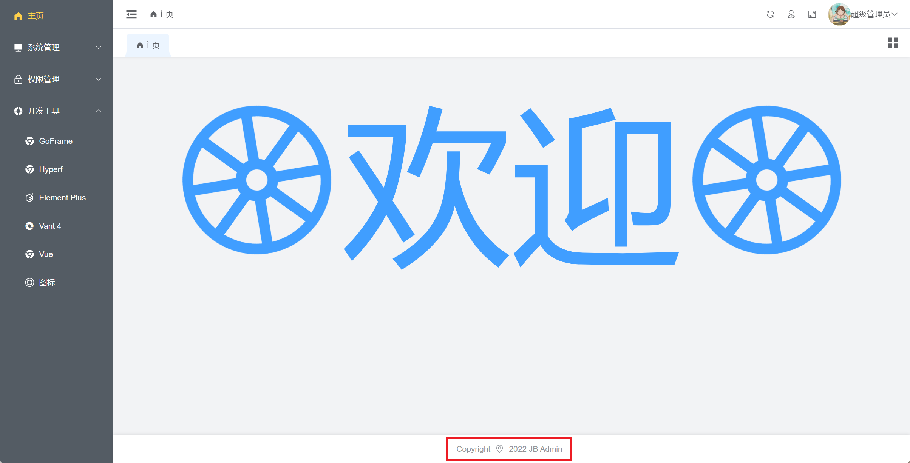

<div align=center>

</div>
<div align=center>

# JB Admin
</div>
<div align=center>


</div>

# 重要提示

如果您将此项目用于商业用途，请遵守[Apache2.0协议](./LICENSE)并保留作者技术支持声明。您需保留如下版权声明信息，其它功能不做任何限制。如需剔除请联系作者购买授权（往下翻有作者微信）



# [文档目录](./文档)说明

项目内[文档目录](./文档)含有本人记录的学习资料，提供给有兴趣的同学学习使用。

其内含有环境搭建，配置示例等文件。例如：[项目的nginx配置文件示例](./文档/配置示例/nginx/admin.conf)

# 常用命令（服务端GO和PHP任选一个。推荐使用GO服务端，功能更多，如全自动代码生成）

#### GO服务端（代码目录：[api](./api)）
```bash
# 服务启动（--gf.gcfg.file用于指定配置文件，默认config.yaml）
gf run main.go -a "http --gf.gcfg.file=config.prod.yaml"

# 代码自动生成（需先编译生成可执行文件。如修改api/internal/cmd/my-gen/文件下的代码，需重新编译才会生效）
./main myGen

# dao层生成（一般很少使用，建议直接使用代码自动生成命令）
gf gen dao

# service层生成（一般很少使用，建议直接使用代码自动生成命令）
gf gen service
```

#### VUE前端（代码目录：[view/platform](./view/platform)）
```bash
# 服务启动
npm run dev
# 打包
npm run build
# 代码格式化
npm run format
```

## 代码自动生成流程（强烈建议搭配Git使用）

1.新建数据库表（建表规范如下）。如：auth_test
```
表名统一使用蛇形命名。不同功能表按以下表规则命名
	主表：正常命名即可。参考以下示例
		platform_admin
		user
		good
		good_category
	扩展表（一对一）：表命名：主表名_xxxx，并存在与主表（主键 或 表名去掉前缀 + ID）同名的id后缀字段，且字段设为：非递增主键 或 唯一索引
	扩展表（一对多）：表命名：主表名_xxxx，并存在与主表（主键 或 表名去掉前缀 + ID）同名的id后缀字段，且字段设为：普通索引
		参考以下示例
			user_config		说明：存放user主表用户的配置信息
			good_content	说明：存放good主表商品的详情
			good_image		说明：存放good主表商品的图片
	中间表（一对一）：表命名：主表名_rel_to_xxxx 或 xxxx_rel_of_主表名，同模块时，后面部分可省略独有前缀，并存在至少2个与关联表（主键 或 表名去掉前缀 + ID）同名的id后缀字段。主表的关联字段设为：非递增主键 或 唯一索引
	中间表（一对多）：表命名：主表名_rel_to_xxxx 或 xxxx_rel_of_主表名，同模块时，后面部分可省略独有前缀，并存在至少2个与关联表（主键 或 表名去掉前缀 + ID）同名的id后缀字段。所有表的关联字段设为：联合主键 或 联合唯一索引
	关于扩展表和中间表的区别说明，特别是扩展表（一对一）和中间表（一对一）很容易让人误解：
		扩展表各字段功能独立，故当存在除主表id字段外的其它id后缀字段时，这些id后缀字段在更新时，都可设为0，不会删除与主表id对应的记录。且扩展表记录一般只在主表做删除时，才会删除
		中间表其它非id后缀字段，功能都是依赖于id后缀字段存在的，故当除主表id字段外的其它id后缀字段在更新时，如果都设为0，会删除与主表id对应的记录

表字段名统一使用小驼峰或蛇形命名（建议：小驼峰）
	尽量根据表名设置以下两个字段（作用1：常用于前端部分组件，如my-select或my-cascader等组件；作用2：用于关联表查询）
		xxId主键字段。示例：good表命名goodId, good_category表命名categoryId
			注意：考虑兼容旧数据库，主键可命名为id（id命名只允许用于独立主键，表其它字段禁用；表是联合主键则全表禁用）
		xxName或xxTitle字段。示例：good表命名goodName, article表命名articleTitle
			注意：如果不存在xxName或xxTitle字段，按以下优先级使用
				表名去掉前缀 + Name > 主键去掉ID + Name > Name >
				表名去掉前缀 + Title > 主键去掉ID + Title > Title >
				表名去掉前缀 + Phone > 主键去掉ID + Phone > Phone >
				表名去掉前缀 + Email > 主键去掉ID + Email > Email >
				表名去掉前缀 + Account > 主键去掉ID + Account > Account >
				表名去掉前缀 + Nickname > 主键去掉ID + Nickname > Nickname

	字段都必须有注释。以下符号[\n\r.。:：(（]之前的部分或整个注释，将作为字段名称使用

	字段按以下规则命名时，会做特殊处理，其它情况根据字段类型做默认处理
		限制命名：
			ID			命名：id；		只允许用于独立主键，表其它字段禁用；表是联合主键则全表禁用
			Label		命名：label；	全表禁用

		固定命名：
			父级		命名：pid；	类型：int等类型；
			层级		命名：level，且pid,level,idPath|id_path同时存在时（才）有效；	类型：int等类型；
			层级路径	命名：idPath|id_path，且pid,level,idPath|id_path同时存在时（才）有效；	类型：varchar或text；
				建议直接使用text，当level层级大时，不用考虑字符长度问题。
				当level层级不大时，可使用varchar，但必须设置足够的字段长度，否则会丢失路径后面的部分字符。
			排序		命名：sort，且pid,level,idPath|id_path,sort同时存在时（才）有效；	类型：int等类型；

		常用命名(字段含[_of_]时，会忽略[_of_]及其之后的部分)：
			密码		命名：password,passwd后缀；		类型：char(32)；
			加密盐 		命名：salt后缀，且对应的password,passwd后缀存在时（才）有效；	类型：char；
			名称		命名：name,title后缀；			类型：varchar；
			标识		命名：code后缀；				类型：varchar；
			账号		命名：account后缀；				类型：varchar；
			手机		命名：phone,mobile后缀；		类型：varchar；
			邮箱		命名：email后缀；				类型：varchar；
			链接		命名：url,link后缀；			类型：varchar；
			IP			命名：IP后缀；					类型：varchar；
			关联ID		命名：id后缀；					类型：int等类型；
			排序|权重	命名：sort,weight等后缀；		类型：int等类型；
			状态|类型	命名：status,type,method,pos,position,gender等后缀；类型：int等类型或varchar或char；注释：多状态之间用[\s,，;；]等字符分隔。示例（状态：0待处理 1已处理 2驳回 yes是 no否）
			是否		命名：is_前缀；					类型：int等类型；注释：多状态之间用[\s,，;；]等字符分隔。示例（停用：0否 1是）
			开始时间	命名：start_前缀；				类型：timestamp或datetime或date；
			结束时间	命名：end_前缀；				类型：timestamp或datetime或date；
			(富)文本	命名：remark,desc,msg,message,intro,content后缀；类型：varchar或text；前端对应组件：varchar文本输入框，text富文本编辑器
			图片		命名：icon,cover,avatar,img,img_list,imgList,img_arr,imgArr,image,image_list,imageList,image_arr,imageArr等后缀；类型：单图片varchar，多图片json或text
			视频		命名：video,video_list,videoList,video_arr,videoArr等后缀；类型：单视频varchar，多视频json或text
			数组		命名：list,arr等后缀；类型：json或text；
```

2.使用./main myGen命令自动生成代码（参数参考api/internal/cmd/my-gen/my_gen.go内结构体myGenOption的字段注释）
- 未带参数执行，则需根据提示输入全部参数。示例：./main myGen
- 带全部参数执行，只会提示搭配Git使用。示例：./main myGen -sceneCode=platform -dbGroup=default -dbTable=auth_test -removePrefixCommon= -removePrefixAlone=auth_ -commonName=权限管理/测试 -isList=1 -isCount=1 -isInfo=1 -isCreate=1 -isUpdate=1 -isDelete=1 -isApi=1 -isAuthAction=1 -isView=1 -isResetLogic=0

## 常见错误处理

1.遇到dao层互相引用错误import cycle not allowed时，参考文件[allow.go](./internal/dao/user/allow/allow.go)解决

## 微信交流群
| 微信 |
|  :---:  | 
|  

添加微信，备注"加入JB Admin交流群"

## 捐献
| 请作者喝饮料 |
|  :---:  | 
|  

## 商用注意事项

如果您将此项目用于商业用途，请遵守[Apache2.0协议](./LICENSE)并保留作者技术支持声明。